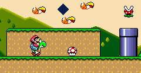

### Bunch of C++ code I did when I was not doing anything else.

#### This started as Design Patterns in C++ repository, but now hosts other stuff as well.

#### Motivation

I have been reading about Software Architectures and Design Patterns for long. Many of us might find them unnecessary at times but they do really make code better. For example, having a Strategy Pattern is way better than writing so many switch and if-else-if. They provide very good layer of abstraction. Design Patterns make code reusable. And yes, I agree, they are unnecessary at times so we can skip them whn not required strongly.

The most beneficial advantage of these design patterns is Communication. Instead of explaining this, that and then that should happen in software, someone can just explain the requirement and label a design pattern.

#### What this repo has

##### <s>Old Design Patterns Introduction <s>

<s>Exactly what the title says. I will be adding more patterns as I get time, may be in some other language as well. As of now, patterns are divided into four categories.

<ol>

<li><s>Creational Patterns</s></li>

<li><s>Structural Patterns</s></li>

<li><s>Behavioural Patterns</s></li>

<li><s>Concurrency Patterns</s></li>

</ol>
</s>

#### Anyway, here is the current structure.
```
-iDoCpp  <---- You are Here. 
 |-- Design Patterns  <---- Old Design Patterns code was moved here
 |-- supplements  <---- Supplmentary codes for this repository
 |   |-- flood-fill
 |   |-- opencv
 |	     |-- object size detection 
 |-- Terminal  Stuff <----   
```

### Design Patterns
There are around 25 Design Patterns with sample scenario in the repository. All of them are implemented in C++.


### Supplements
The `opencv` directory hold the projects which are using OpenCV library. The current solo member is `Object Size Detection` which estimates the size of the object using a reference point.
`flood-fill` directory holds the project which uses `flood-fill` algorithm and different approaches of filling a colour to create images. The GIF running on top is the result of one such flood-fill algorithm.

### Terminal Stuff
This has the random code done which runs in terminal only.
#### Terminal Graphs
Will you ever use this to see graphs in terminal?
Well you won't but someone might.

That is it as of now.
<i>Auf weider sehen. This is the way.</i>
